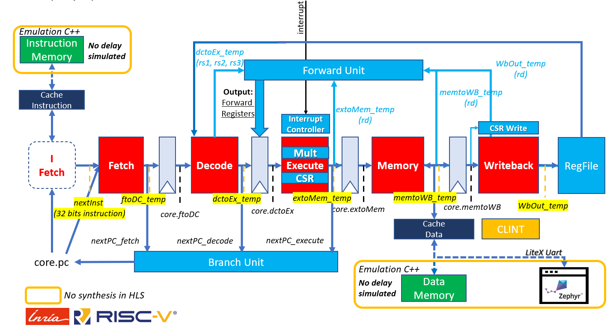

# Comet

A RISC-V 32-bit processor written in C++ for High Level Synthesis (HLS).
Support for the RV32I base ISA, the **M** (Multiplication), the **A** (Atomic), and the **Zicsr** extension. The Comet simulator is able to simulate the **Core-Local Interrupt controller** (CLINT). There is [branch dedicated to the support of the F extension](https://gitlab.inria.fr/srokicki/Comet/tree/rv32imf) but it is not stable yet and may not be in a functional state.

The full documentation of the core is inside `<repo_root>/docs/comet_doc.pdf`

